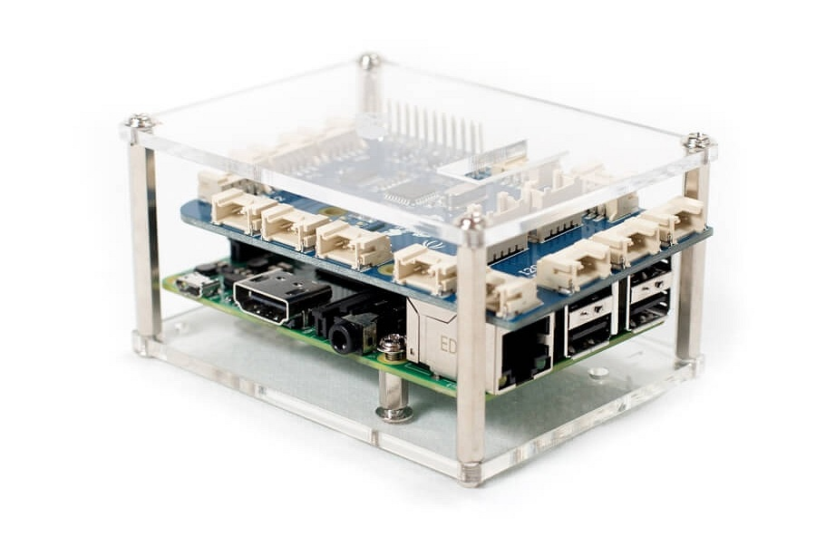

# PREREQUISITES

### 1. Hardware
   - **Raspberry Pi 3 Model B+ with 2.5A USB Power Supply**
   - https://www.amazon.ca/gp/product/B07BD3WHCK?pf_rd_p=46535598-d2e0-4bc4-8392-182d8c1e93fc&pf_rd_r=8RP3JR7MBMBSZEBMQAZY
   
   - **Camera Module 5MP REV 1.3 for Raspberry Pi 3 Model B**
   - https://www.amazon.ca/Keyestudio-Camera-Module-5MP-Raspberry/dp/B073RCXGQS/ref=sr_1_2?keywords=picam&qid=1560352003&s=gateway&sr=8-2
   
   - **32GB MicroSD Card**
   - https://www.amazon.ca/Sandisk-SDSQUAR-032G-GN6MA-Ultra-Micro-Adapter/dp/B073JWXGNT/ref=pd_bxgy_img_2/140-3259941-2677726?_encoding=UTF8&pd_rd_i=B073JWXGNT&pd_rd_r=008e5540-8bda-11e9-b2df-b12914933cfb&pd_rd_w=2P8yH&pd_rd_wg=XitDn&pf_rd_p=a62e2918-d998-4bbb-8337-35aac776e851&pf_rd_r=S8RAVR0TXC2BM2388KMH&psc=1&refRID=S8RAVR0TXC2BM2388KMH
   
   - **Grove Pi+ Starter Kit**
   - https://www.seeedstudio.com/GrovePi-Starter-Kit-for-Raspberry-Pi-A-B-B-2-3-CE-certifie-p-2572.html
   
   - **Grove Pi+ Case for Raspberry Pi**
   - https://shop.dexterindustries.com/grovepi-case/
   

### SOFTWARE
   - You may follow the steps outlined below to install the necessary software in order to run the workshop (i.e. Raspbian OS, Pi Camera Module, Greengrass Core)
   - Alternatively you may download a pre-built Micro-SD image from the link below and use the Win32 Disk Imager to write it onto your Micro-SD cards. Please note that this image was burned from a 32GB Micro-SD card described above and it is may not install on any other card type or size variation.
   - Refer to step 5 below on how to install Win32 Disk Imager and how to write the image after you download the image from the link below
   

   **PREBUILT MICRO-SD IMAGE - https://tinyurl.com/iot-workshop-microSD-v1**

### 2. Install Raspbian using NOOBS and test hardware

   - REFERENCE: https://www.raspberrypi.org/documentation/installation/noobs.md

   - Download and install SD card formatter - https://www.sdcard.org/downloads/formatter_4/
   - Insert your SD Card and make sure it's inserted writeable
   (i.e. push switch on left side up towards the end which plugs into the drive)
   - Format the the SD card in FAT format
   - Download noobs - https://downloads.raspberrypi.org/NOOBS_lite_latest
   - Download and extract the files from the NOOBS zip file.
   - Copy the extracted files onto the SD card that you just formatted, so that this file is at the root directory of the SD card. Please note that in some cases it may extract the files into a folder; if this is the case, then please copy across the files from inside the folder rather than the folder itself.
   - Insert the SD card into the Raspberry Pi, plugin Camera Module and Grove Pi+ card, connect a monitor using HDMI, keyboard + mouse using USB and power it up.
   - When prompted enter WiFi SSID and password
   - **(75 mins)** Select Raspbian Full and press Install button
   - Configure WiFi, SSH, Camera & I2C using raspi-config
     sudo raspi-config (Config SSH, Camera & I2C under interface options)
   - Update SSH daemon to work on port 80 so it works in AWS Guest networks.
     - vi /etc/ssh/sshd_config and change default port to 80
   - **(25 mins)** Install Grove Pi+ software
   REFERENCE: https://www.dexterindustries.com/GrovePi/get-started-with-the-grovepi/
     - sudo curl -kL dexterindustries.com/update_grovepi | bash
     - sudo reboot
   - Check I2C interface is working
   pi@raspberrypi:~ $ sudo i2cdetect -y 1
<pre>
     0  1  2  3  4  5  6  7  8  9  a  b  c  d  e  f
00:          03 04 -- -- -- -- -- -- -- -- -- -- -- 
10: -- -- -- -- -- -- -- -- -- -- -- -- -- -- -- -- 
20: -- -- -- -- -- -- -- -- -- -- -- -- -- -- -- -- 
30: -- -- -- -- -- -- -- -- -- -- -- -- -- -- 3e -- 
40: -- -- -- -- -- -- -- -- -- -- -- -- -- -- -- -- 
50: -- -- -- -- -- -- -- -- -- -- -- -- -- -- -- -- 
60: -- -- 62 -- -- -- -- -- -- -- -- -- -- -- -- -- 
70: -- -- -- -- -- -- -- -- 
</pre>
   - **(35 mins)** Configure Raspberry Pi's camera module
     - sudo apt-get update
     - sudo apt-get dist-upgrade
     - sudo apt-get install -y python-dev python-setuptools python-pip python-picamera
     - sudo reboot
   - Test by capturing a still image from the camera
     - raspistill -v -o test.jpg

### 3. Install Greengrass Core

   REFERENCE: https://docs.aws.amazon.com/greengrass/latest/developerguide/module1.html
   - sudo adduser --system ggc_user
   - sudo addgroup --system ggc_group
   - sudo vi /etc/sysctl.d/98-rpi.conf
   - Add the following lines then reboot:
     fs.protected_hardlinks = 1
     fs.protected_symlinks = 1
   - sudo reboot
   - After reboot verify the setting took with:
     - sudo sysctl -a 2> /dev/null | grep fs.protected
     - You should see fs.protected_hardlinks = 1 and fs.protected_symlinks = 1.
   - cd /boot
   - sudo vi cmdline.txt and add the following text to end of the line (NOT AS A NEW LINE):
     cgroup_enable=memory cgroup_memory=1
   - sudo reboot
   - Install Node.js 12 (for Greengrass)
     - cd ~/Downloads
     - wget https://nodejs.org/dist/v12.9.1/node-v12.9.1-linux-armv7l.tar.gz
     - sudo su
     - cd /usr/local
     - tar xvfz /home/pi/Downloads/node-v12.9.1-linux-armv7l.tar.gz
     - cd /usr/bin
     - ln -s /usr/local/node-v12.9.1-linux-armv7l/bin/node nodejs12.x
   - Install Java 8
     - sudo apt-get update
     - sudo apt-get install openjdk-8-jdk
     - sudo su
     - cd /usr/bin
     - ln -s /usr/bin/java java8
   - Download and run the Greengrass dependency checker:
     - cd /home/pi/Downloads
     - mkdir greengrass-dependency-checker-GGCv1.10.x
     - cd greengrass-dependency-checker-GGCv1.10.x
     - wget https://github.com/aws-samples/aws-greengrass-samples/raw/master/greengrass-dependency-checker-GGCv1.10.x.zip
     - unzip greengrass-dependency-checker-GGCv1.10.x.zip
     - cd greengrass-dependency-checker-GGCv1.10.x
     - sudo modprobe configs
     - sudo ./check_ggc_dependencies | more

### 4. Install software for IoT Core Workshop

   - Install Node.js 10 (for Grove PI)
     - cd ~/Downloads
     - wget https://nodejs.org/dist/v10.9.0/node-v10.9.0-linux-armv7l.tar.gz
     - sudo su
     - cd /usr/local
     - tar xvfz /home/pi/Downloads/node-v10.9.0-linux-armv7l.tar.gz
     - cd /usr/bin
     - ln -s /usr/local/node-v10.9.0-linux-armv7l/bin/node
     - ln -s /usr/local/node-v10.9.0-linux-armv7l/bin/npm
   - Copy workshop software onto your pi and test Grove Pi+ (get it from https://github.com/joeireland/iot-core-workshop - software/iot-workshop-software.tgz)
     - scp -P 80 iot-workshop-software.tgz pi@IP-OF-PI:/tmp
     - ssh -p 80 pi@IP-OF-PI
     - cd ~
     - tar xvfz /tmp/iot-workshop-software.tgz
     - cd ~/Development/grove-ip-nodejs
     - npm install
     - node index.js
     - cd ~/Development/grove-nodejs
     - npm install
     - node index.js
     - cd ~/Development/ble-nodejs
     REFERENCE: https://github.com/OpenZWave/node-openzwave-shared/blob/master/README-raspbian.md
     - sudo apt-get install -y libudev-dev
     - wget "https://github.com/ekarak/openzwave-debs-raspbian/raw/master/v1.4.79/openzwave_1.4.79.gfaea7dd_armhf.deb"
     - wget "https://github.com/ekarak/openzwave-debs-raspbian/raw/master/v1.4.79/libopenzwave1.3_1.4.79.gfaea7dd_armhf.deb"
     - wget "https://github.com/ekarak/openzwave-debs-raspbian/raw/master/v1.4.79/libopenzwave1.3-dev_1.4.79.gfaea7dd_armhf.deb"
     - sudo dpkg -i *openzwave*.deb
     - rm *openzwave*.deb
     - npm install
   - Update rc.local so it prints the IP address of the Raspberry Pi at boot time
     - sudo vi /etc/rc.local
     - add the following line to the end of the file:
     /usr/bin/node /home/pi/Development/grove-ip-nodejs/index.js
     - sudo reboot

### 5. Clone SD Card to write to other Raspberry Pi devices

   - Download and Install Win32 Disk Imager - https://sourceforge.net/projects/win32diskimager/files/latest/download
   - Insert SD Card of Raspberry Pi with above steps completed
   - **(45 mins)** Perform "Read" of card and store the image onto your disk of your PC.
   - Once completed eject the SD card
   - Insert a new SD Card and format it using SD card formatter
   - **(45 mins)** Launch Win32 Disk Imager and write the saved image onto the new SD card
   - Repeat the above steps for all Raspberr Pi stations

# POST WORKSHOP CLEANUP

   - ssh onto your Raspberry Pi
   - sudo /greengrass/ggc/core/greengrassd stop
   - sudo rm -rf /home/pi/Development/iot-workshop
   - sudo rm -rf /home/pi/Development/iot-workshop-lambda
   - sudo rm -rf /home/pi/Development/iot-workshop-greengrass
   - sudo rm -rf /greengrass

# Start Workshop

[Part 1 - Assemble and Test Raspberry Pi](./Workshop1-GrovePi.md)