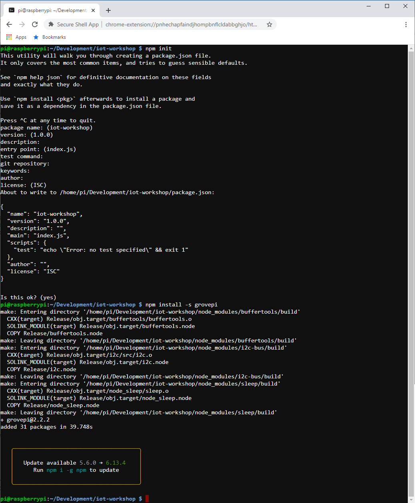
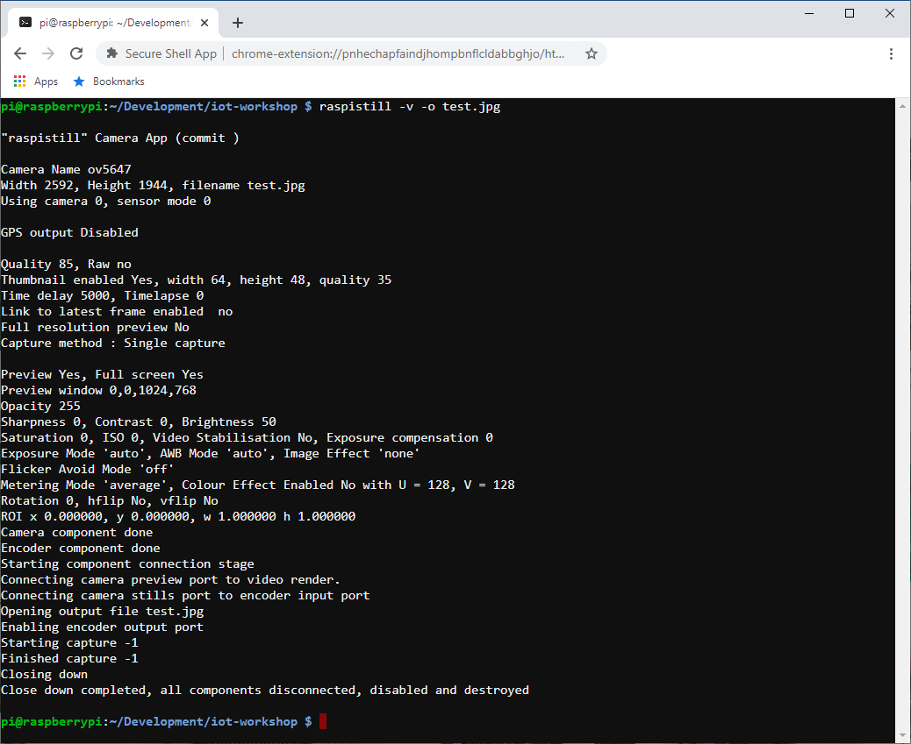
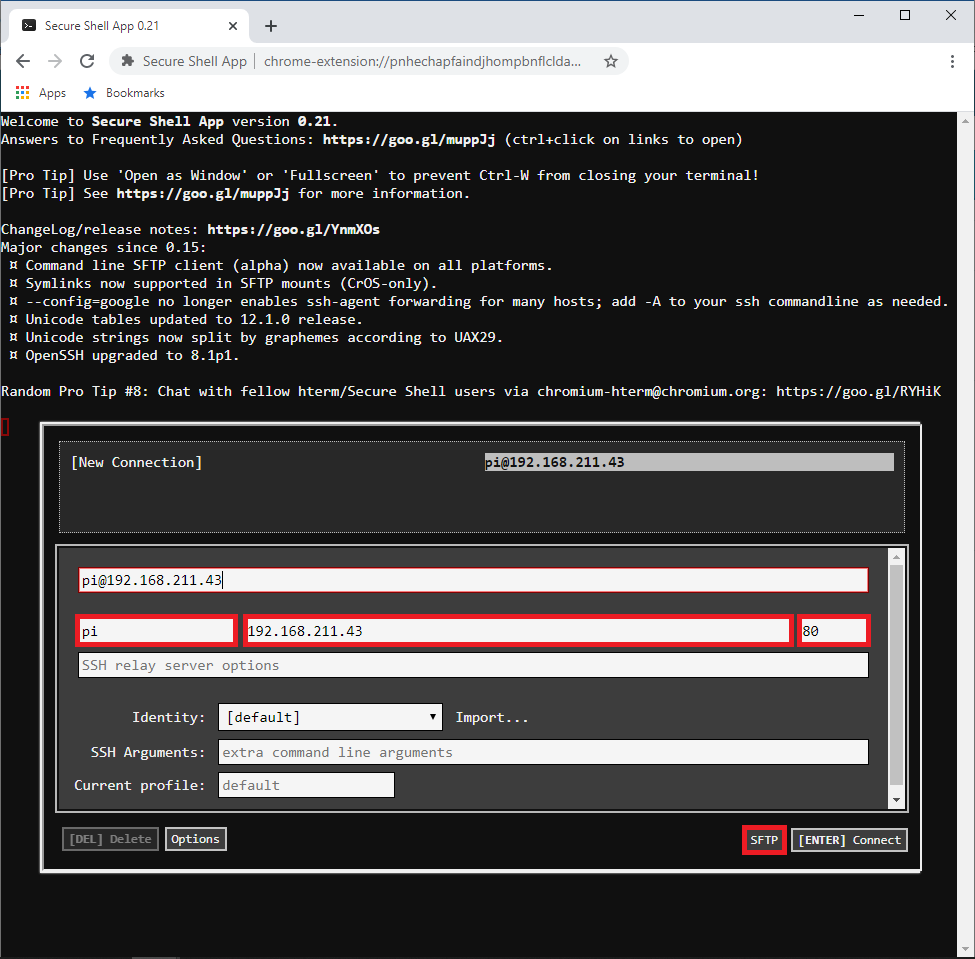

# PART 1: Assemble and Test Raspberry Pi

In this lab you will assemble and familiarize yourself with your Raspberry Pi, Pi Camera and Grove Pi+ sensor kit. Afterwards, you will learn how to connect to your Raspberry Pi using SSH to make configuration changes to it. You will use SFTP to securely copy files between it and your laptop. Finally, you complete the lab by writing a Node.js program to control and monitor its Grove Pi+ sensors.

### Architecture

   

### 1. Connect Camera to Raspberry Pi
   - Lift up the connector levers on the both sides of the connector
   - Gently push the camera module's ribbon cable into the Raspberry Pi
   - Ensure the blue-side is facing the Ethernet jack and that it's properly seated
   - Push down the connector levers to secure the camera module's ribbon cable

   

### 2. Connect Grove Pi+ sensor board to Raspberry Pi
   - **IMPORTANT: Make sure Raspberry Pi power supply IS NOT connected before inserting the Grove Pi+**
   - Be careful to ensure that the pins are properly aligned as shown below

   

### 3. Observe Connected Input/Output Devices
   - Red LED is connected to D2 digital I/O line
   - Blue LED is connected to D3 digital I/O line
   - Push button is connected to D7 digital I/O line
   - Buzzer is connected to D8 digital I/O line
   - Angle sensor is connected to A0 analog input line
   - LCD screen is connected to I2C-1 output line

   

### 4. Connect power supply to Raspberry Pi
   - Once powered the red LED turns on and the green LED flashes

   

### 5. Determine IP address of Raspberry Pi
   - While the Raspberry Pi boots you'll see a message on the LCD display indicating it's **Starting**
   - After the Raspbery Pi boots it diplays the IP address in green as shown below (in your case the IP address may differ). Take note of this IP address for use when you SSH onto the Raspbery Pi.

   

### 6. SSH onto Raspberry PI using Chrome SSH App
   - Launch the **Google Chrome Secure Shell App** (install app if not already installed using this URL - https://chrome.google.com/webstore/detail/secure-shell-app/pnhechapfaindjhompbnflcldabbghjo?hl=en)
   - Press **Apps** icon displayed on your bookmark bar

   
   - Press **Secure Shell App** icon

   

   - Enter a username of **pi**, the IP address displayed on the LCD screen connected to your Raspberry Pi, enter port ***80*** and press the **[ENTER] Connect** button.

   **NOTE: The password to use when logging in is written on your Raspberry Pi case. Also note that the IP address assigned to your Raspberry Pi may differ from the example shown in the screen capture below.**

   

### 7. Create Node.js program to test the Grove Pi+ Sensors
   - Create a directory, initalize a Node.js project using **npm init** and install the **grovepi** NPM library for use by the project using the following commands:

   pi@raspberrypi:~ $ **cd ~/Development** 
   pi@raspberrypi:~ $ **mkdir iot-workshop** 
   pi@raspberrypi:~ $ **cd iot-workshop** 
   pi@raspberrypi:~ $ **npm init** *(for each prompt press enter to select the default value)*  
   pi@raspberrypi:~ $ **npm install -s grovepi** *(Ignore all warning this may generate)* 

   
   - Create a test program to control the Grove Pi+ board and its sensors. The program will flash the Red LED light, beep the buzzer, detect button presses and detect angle sensor changes. Use your favorite editor to save this program to a file named **index.js** 

   pi@raspberrypi:~ $ **nano index.js** *(press control-X to exit and press Y to save the file)* 

   **HINT: Use the right mouse button to copy and paste when using Google Chrome SSH**

   

<pre>
const GrovePi = require('grovepi').GrovePi;
const Board   = GrovePi.board;
const Sensors = GrovePi.sensors;

const red    = new Sensors.DigitalOutput(2);
const blue   = new Sensors.DigitalOutput(3);
const button = new Sensors.DigitalButton(7);
const buzzer = new Sensors.DigitalOutput(8);
const angle  = new Sensors.RotaryAnalog(0);

function main() {
  const board = new Board({
    debug: true,
    onError: onGroveError,
    onInit: onGroveInit
  });

  board.init();
}

function onGroveError(err) {
  console.log('ERROR: ' + JSON.stringify(err));
}

function onGroveInit(res) {
  console.log('GrovePi initialized');

  beep();
  flash();
  monitorButton();
  monitorAngle();
}

function flash() {
  console.log('Flash');

  red.turnOn();
  setTimeout(() => { red.turnOff(); }, 1000);
}

function beep() {
  console.log('Beep');

  buzzer.turnOn();
  setTimeout(() => { buzzer.turnOff(); }, 1000);
}

function blueOn() {
  console.log('Blue On');
  blue.turnOn();
}

function blueOff() {
  console.log('Blue Off');
  blue.turnOff();
}

function monitorButton() {
  console.log('Monitor Button ...');

  button.on('down', res => {
    console.log('Button: ' + JSON.stringify(res));
  });

  button.watch();
}

function monitorAngle() {
  console.log('Monitor Angle ...');

  angle.on('change', res => {
    console.log('Angle: ' + JSON.stringify(res));
  });

  angle.watch(1000);
}

main();
</pre>

### 8. Run the test program

   pi@raspberrypi:~ $ **node index.js** 
   - The red LED should turn on and off once
   - The buzzer should beep once
   - Turn the angle sensor and see the **angle** changes
   - Press the push button and see **singlepress** indications
   - Press and hold the push button for 2 seconds then release and see a **longpress** indication
   - Press CTRL-C to exit the test

   
   

### 9. Test the Camera

   pi@raspberrypi:~ $ **raspistill -v -o test.jpg**  
   *this will capture a picture and store it in test.jpg*

   

   - Launch the **Google Chrome Secure Shell App** in another tab to start an SFTP session
   - Enter a username of **pi**, the IP address displayed on the LCD screen connected to your Raspberry Pi, enter port **80** and press the **SFTP** button.

   
   **NOTE: The password to use when logging in is written on your Raspberry Pi case. Also note that the IP address assigned to your Raspberry Pi may differ from the example shown in the screen capture below.**

   

   nasftp ./ > **cd ~/Development/iot-workshop** 
   nasftp /home/pi/Development/iot-workshop/ > **get test.jpg** 

   

   - Save file in your Downloads directory of your laptop. Once saved, open it to verify it took a proper picture.

   

# Continue Workshop

[Part 2 - AWS IoT Device Registration](./Workshop2-DeviceOnboarding.md)