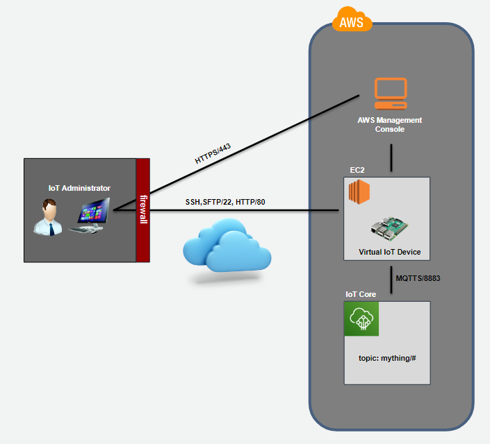
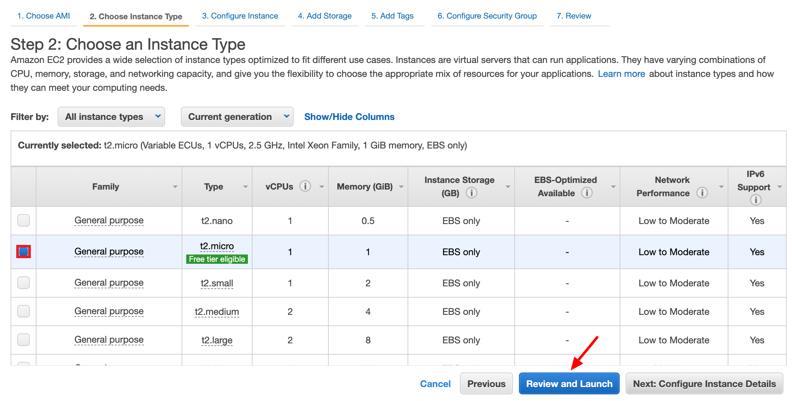
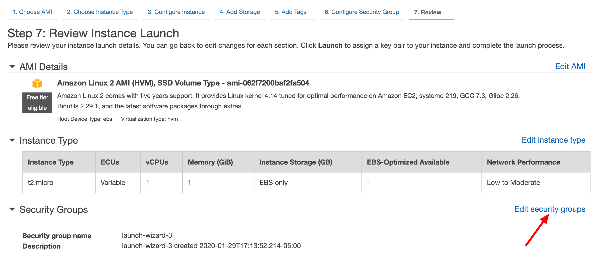

# PART 1: Virtual IoT Device Simulator

In this lab you will install and configure your virtual IoT device for use by this workshop. Specifically, you will spin up an EC2 instance and install the virtual IoT device and dependent software onto it. It should be noted that the virtual IoT device only requires Node.js to run and therefore could run locally on any system which supports Node.js. However, for the purpose of this workshop we will choose to run the IoT similator within an AWS EC2 instance.

### Architecture

   

### 1. Launch EC2 Instance running Amazon Linux 2

   - Login to AWS console
   - Go to **Services/EC2** and select **Instances**
   - Press the **Launch Instance** button

   

   - Choose the **Amazon Linux 2 - 64-bit** AMI and press the **Select** button

   

   - Choose **General purpose, t2 micro** instance type and press the **Review and Launch** button

   

   - Select **Edit security group**

   

   - Select **Create a new security group**
   - Enter a **Security group name** of **iot-virtual-device**
   - Enter a **Description** of **Virtual Device Security Group**
   - Press **Add Rule** button

   

   - Select **Type=HTTP**, **Protocol=TCP**, **Port=80**, **Source=0.0.0.0, ::0**
   - Press **Review and Launch** button

   **NOTE: In a production environment you would typically create a more constrained Source for your security group rules**

   

   - Scroll down and select **Edit Tags**

   

   - Press the **Add Tag** button

   

   - Enter a **Key** of **Name**
   - Enter a **Value** of **iot-virtual-device**
   - Press the **Review and Launch** button

   

   - Press the **Launch** button

   

   - Select **Create a new key pair**
   - Enter a keypair name of **iot-virtual-device**
   - Press the **Download Key Pair** button
   - When prompted save that key pair to your disk.

   

   - Press the **Launch Instances** button

   

   - You will see a screen similar to the following which indicates that your instance is now being launched.
   - Press the **View instance** button

   

   - Periodically refresh the web page until your EC2 instance indicates its status is **running**
   - Select the **instance ID** link to inspect your EC2 instance.

   

   - Select the **Network and Security** tab
   - Take note of the public IP address of your running EC2 instance. You will use this for your SSH hostname to access below. You will also use this for the URL when accessing your virtual IoT device.

   

### 2. SSH onto the EC2 Instance

   - Launch the **Google Chrome Secure Shell App** (install app if not already installed using this URL - https://chrome.google.com/webstore/detail/secure-shell-app/pnhechapfaindjhompbnflcldabbghjo?hl=en)
   - Press **Apps** icon displayed on your bookmark bar

   
   - Press **Secure Shell App** icon
   - Enter a username of **ec2-user**, the public IP address of your EC2 instance and enter port **22**
   - Press **Import...** and import the **iot-virtual-device.pem** file you downloaded when creating your EC2 instance.
   - Select the **iot-virtual-device.pem** file when prompted.

   
   

   - Select the **iot-virtual-device.pem** Identity you just imported (**NOTE: If it doesn't show up in the selection list you may need to wait longer for the .pem file to upload or you many need to refresh the page on your web browser**)
   - Press the **[ENTER] Connect** button.

   

### 3. Install Virtual IoT Device

   [ec2-user@ip-172-31-29-44 ~]$ **wget https://nodejs.org/dist/v10.18.1/node-v10.18.1-linux-x64.tar.gz** 
   [ec2-user@ip-172-31-29-44 ~]$  **sudo su** 
   [ec2-user@ip-172-31-29-44 ~]$ **cd /usr/local** 
   [ec2-user@ip-172-31-29-44 ~]$ **tar xvfz /home/ec2-user/node-v10.18.1-linux-x64.tar.gz** 
   [ec2-user@ip-172-31-29-44 ~]$ **cd /usr/sbin** 
   [ec2-user@ip-172-31-29-44 ~]$ **ln -s /usr/local/node-v10.18.1-linux-x64/bin/node** 
   [ec2-user@ip-172-31-29-44 ~]$ **ln -s /usr/local/node-v10.18.1-linux-x64/bin/npm** 
   [ec2-user@ip-172-31-29-44 ~]$ **exit** 
   [ec2-user@ip-172-31-29-44 ~]$ **wget https://github.com/joeireland/iot-core-device-simulator/archive/master.zip** 
   [ec2-user@ip-172-31-29-44 ~]$ **unzip master.zip** 
   [ec2-user@ip-172-31-29-44 ~]$ **cd iot-core-device-simulator-master** 
   [ec2-user@ip-172-31-29-44 ~]$ **npm install** 
   [ec2-user@ip-172-31-29-44 ~]$ **sudo node index.js --port=80** 

   

### 4. Test Virtual IoT Device

   - Open another tab in Chrome
   - Enter a URL of **http://YOUR-EC2-INSTANCE-PUBLIC-IP-ADDRESS**
   - You should be presented with the virtual IoT device simulator as shown below.
   - Press the **OK** button. Once pressed the **Red LED** will flash and the buzzer will beep indicating it is connected and online.

   

   - Press the push **Button** to simulate pressing the button
   - Move the **Slider** back and forth to simulate changing the angle sensor

   

   - Notice the button and angle change events detected by the simulator

   
