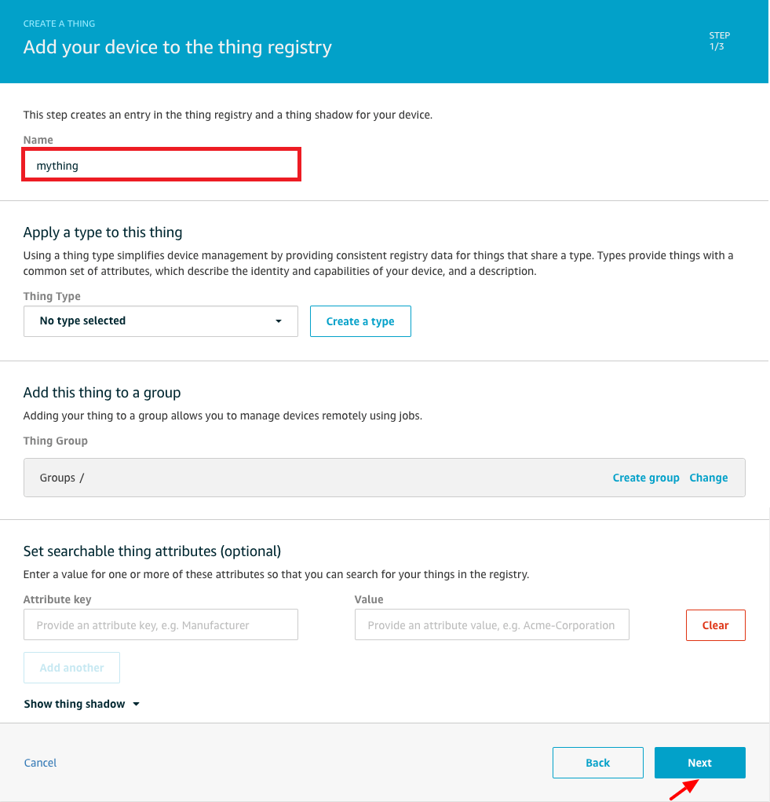
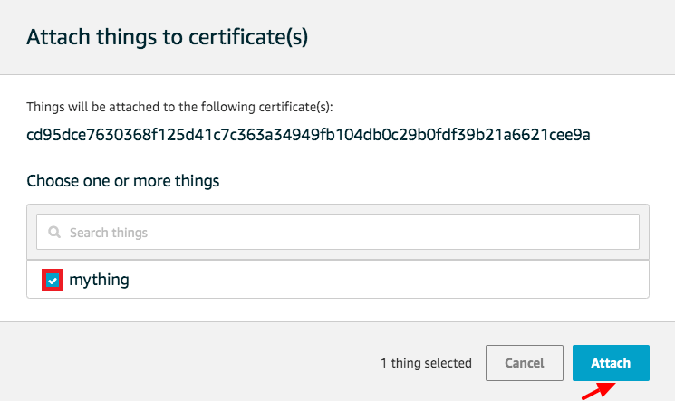
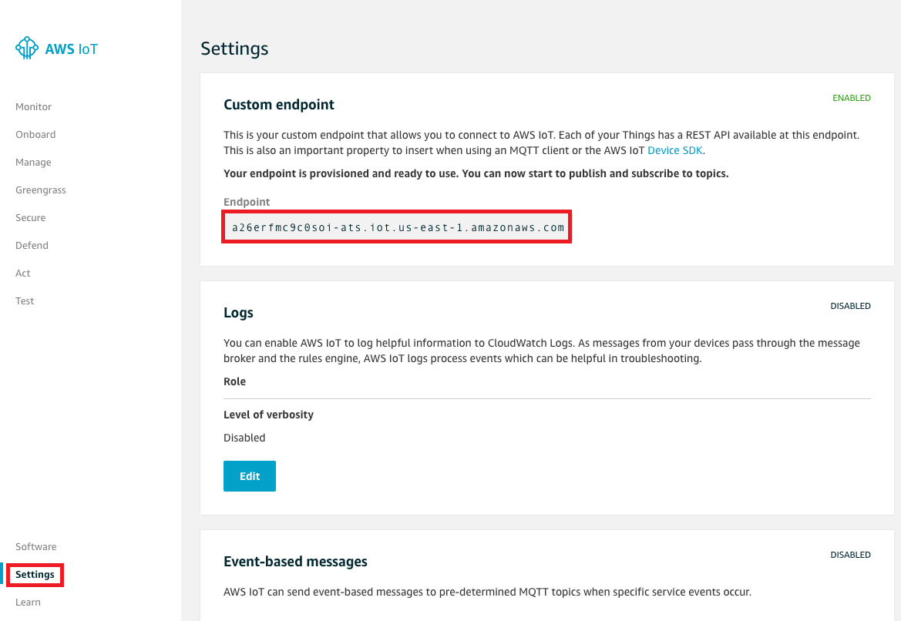
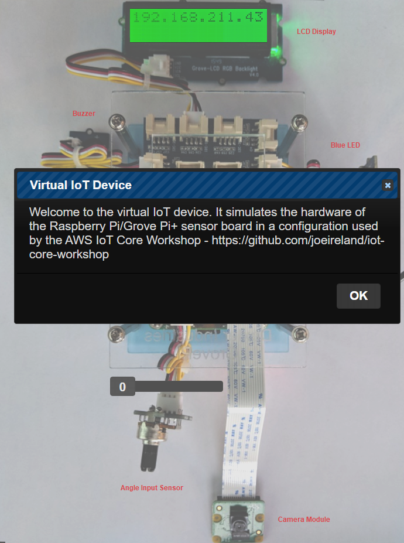
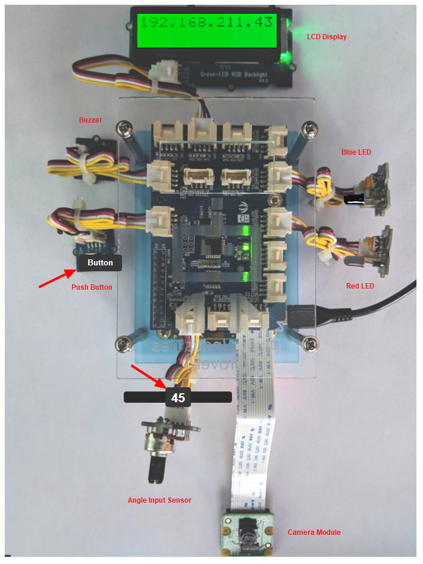
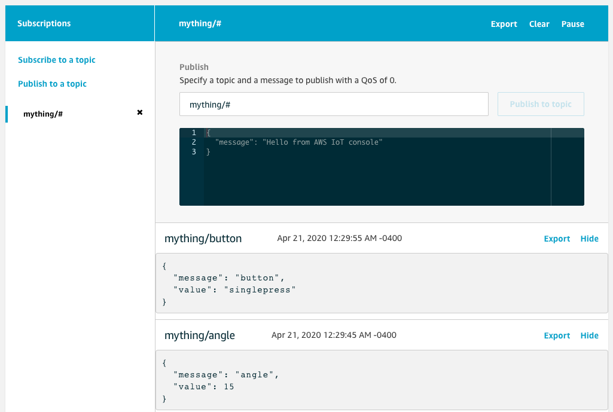

# PART 2: AWS IoT Device Registration

In this lab you will convert your virtual device program, which can control and monitor its attached virtual sensors, to securely connect as a **"Thing"** to the AWS IoT cloud. Once that is completed, you will interact with your device using the IoT Test MQTT client from the AWS cloud.

### Architecture

   

### 1. Register your device to AWS IoT Core
   - Login to AWS console and ensure your region is **US East (N. Virginia)**

   

   - Go to **Services/IoT Core** by entering **IoT Core** in the Find Services field and pressing **Enter**

   

   - If this is the first time you've used **IoT Core** you may be presented with a **Get Started** dialog
   - Press the **Get started** button to continue

   

   - Select **Manage/Things**
   - Press **Register a thing** button

   

   - Press **Create a single thing** button
   

   
   
   - Enter **Name=mything** and press **Next** button
   

   

### 2. Create a certificate for your IoT thing
   - Press **Create certificate** button

   

   - Download **A certificate for this thing** and save it as **Downloads/certs/cert.pem** on your laptop
   - Download **public key** and save it as **Downloads/certs/public.pem** on your laptop
   - Download **private key** and save it as **Downloads/certs/private.pem** on your laptop
   - Download **A root CA for AWS IoT** save it as **Downloads/certs/rootCA.pem** on your laptop

   
---
   
---
   - Close the CA Certificates tab pane once you've dowloaded your root CA cert file.
   - Press **Done** button *(make sure you've downloaded your certs as shown above before you do this)*

   

### 3. Create an IoT Policy for your Thing
   - Select **Secure/Policies**
   - Press "Create a policy" button

   
   
   - Enter **Name=mything-policy**
   - Enter **Action=iot:\***
   - Enter **Resource ARN=\***
   - Select **Effect=Allow**
   - Press **Create** button 
     *NOTE: Typically you would make a more constrained policy in a production environment*

   
---
   

### 4. Attach your IoT Policy to the device certificate
   - Select **Secure/Certificates**
   - Select **...** pulldown menu of your certificate, and select **Attach policy**

   

   - select your policy **mything-policy**
   - press **Attach** button

   
   

### 5. Attach your certificate to your Thing and activate the certificate
   - Select **Secure/Certificates**
   - Select **...** pulldown menu of your certificate, and select **Attach thing**

   

   - Select your thing **mything**
   - Press **Attach** button

   

   - We'll now activate your certificate.
   - Select **...** pulldown menu of your certificate, and select **Activate**

   

### 6. Locate your IoT Custom Endpoint value
   - Select **Settings** and take note of your **Custom Endpoint** (your value may differ from the example shown below). 
   

   **NOTE: Save this value in your notes for the future. It will be used when you configure the host which your IoT code will connect to below**

   

### 7. Secure copy your previously saved **mything** IoT certificates onto your virtual IoT device

   - Launch the **Google Chrome Secure Shell App** in another tab to start a SFTP session
   - Enter a username of **ec2-user**, the IP address of your EC2 instance, enter port **22**, select an Identity of **iot-virtual-device.pem** and press the **SFTP** button.

   

  nasftp ./ > **cd ~/iot-core-device-simulator-master** 
  nasftp /home/pi/Development/iot-workshop/ > **mkdir certs** 
  nasftp /home/pi/Development/iot-workshop/ > **cd certs** 
  nasftp /home/pi/Development/iot-workshop/certs/ > **put** 

   

  - Select your **mything** IoT certs that you previously stored in **Downloads/certs**

**IMPORTANT: Make sure the names of your files are EXACTLY as shown below. If not you should rename the files to match those exact names or you will not be able to connect your thing successfully to AWS IoT**

   

### 8. SSH onto your virtual IoT device

   - Launch the **Google Chrome Secure Shell App** in another tab to start a SSH session
   - Enter a username of **ec2-user**, the IP address of your EC2 instance, enter port **22**, select an Identity of **iot-virtual-device.pem** and press the **[ENTER] Connect** button.

   

### 9. Update your application to connect to AWS IoT Core as your **mything** you previously created using the AWS Console

   [ec2-user@ip-172-31-29-44 ~]$ **cd ~/iot-core-device-simulator-master** 
   [ec2-user@ip-172-31-29-44 ~]$ **npm install -s aws-iot-device-sdk** 

   
   - Use your favorite editor to modify the test program to connect to AWS IoT Core.  

   [ec2-user@ip-172-31-90-82 ~]$ **nano index.js** *(press control-X to exit and press Y to save the file)* 
   

   

   **IMPORTANT: Replace the host: value with the Custom Endpoint value you took note of earlier** 
   **HINT: If you forgot your Custom Endpoint value you can get it from Iot Core/Settings** 
   **HINT: When using nano use shift and arrow keys to select text and control-K to delete text** 
   **HINT: Right mouse button may be used to copy and paste when using Google Chrome SSH**

<pre>
<b style="color:red">const AWSIoT   = require('aws-iot-device-sdk');</b>
const express  = require('express');
const http     = require('http');
const minimist = require('minimist');
const WS       = require('ws');

const DEFAULT_PORT = 8080;

const app    = express();
const server = http.createServer(app);
const wss    = new WS.Server({ server });

<b style="color:red">let device = null;</b>

function main() {
  let args = minimist(process.argv.slice(2));
  let port = args.port || DEFAULT_PORT;

  app.use('/', express.static('./web'));

  wss.on('connection', onWebSocketConnect);

  server.listen(port, () => {
    console.log('Listening: port=' + server.address().port);
  });
  <b style="color:red">
  device = AWSIoT.device({
    keyPath:  './certs/private.pem',
    certPath: './certs/cert.pem',
    caPath:   './certs/rootCA.pem',
    clientId: 'mything',
    region:   'us-east-1',
    protocol: 'mqtts',
    // IMPORTANT: REPLACE THE HOST VALUE BELOW WITH YOUR CUSTOM ENDPOINT VALUE
    host:     'a26erfmc9c0soi-ats.iot.us-east-1.amazonaws.com',
    debug:    'true'
  });

  device.on('connect', onConnect);
  device.on('message', onMessage);</b>
}
<b style="color:red">
function onConnect() {
  console.log('Connected to AWS IoT Core');
  device.subscribe('mything/flash');
  device.subscribe('mything/beep');
  device.subscribe('mything/blue/#');
  device.publish('mything/messages', '{ "message": "ONLINE" }');
}

function onMessage(topic, buffer) {
  if (topic === 'mything/flash') {
    flash();
  }
  else if (topic === 'mything/beep') {
    beep();
  }
  else if (topic === 'mything/blue/on') {
    blue(1);
  }
  else if (topic === 'mything/blue/off') {
    blue(0);
  }
}
</b>
function onWebSocketConnect(ws, req) {
  console.log('WebSocket Connected');

  ws.on('message', onWebSocketMessage);

  flash();
  beep();
}

function onWebSocketMessage(message) {
  let msg = JSON.parse(message);

  if (msg.sensor === 'button') {
    console.log('Button: ' + msg.value);
    <b style="color:red">device.publish('mything/button', '{ "message": "button", "value": "' + msg.value + '" }');</b>
  }
  else if (msg.sensor === 'angle') {
    console.log('Angle: ' + msg.value);
    angle(msg.value);
    <b style="color:red">device.publish('mything/angle', '{ "message": "angle", "value": ' + msg.value + ' }');</b>
  }
}

function flash() {
  console.log('Flash');

  red(1);
  setTimeout(() => { red(0); }, 1000);
}

function beep() {
  console.log('Beep');

  buzzer(1);
  setTimeout(() => { buzzer(0); }, 1000);
}

function red(value) {
  send({ command: 'red', value: value });
}

function blue(value) {
  send({ command: 'blue', value: value });
}

function angle(value) {
  send({ command: 'angle', value: value });
}

function buzzer(value) {
  send({ command: 'buzzer', value: value });
}

function send(command) {
  wss.clients.forEach((ws) => {
    if (ws.readyState === WS.OPEN) {
      ws.send(JSON.stringify(command));
    }
  });
}

main();
</pre>

### 10. Show connectivity to AWS IoT Core and test your **mything**
   - Login to AWS console
   - Go to **Services/IoT Core**
   - Select **Test**
   - Subscribe **topic=mything/#** and press **Subscribe to topic** button

   

   - Once subscribed, you'll see a message "Hello from AWS IoT console"

   

### 11. Connect your virtual IoT device as **mything** to AWS IoT Core

   - Go back to your tab where you're SSH-ed onto your virtual device and run the program. Make sure you first kill any old versions which may be running.  

   [ec2-user@ip-172-31-90-82 ~]$ **cd ~/iot-core-device-simulator-master** 
   [ec2-user@ip-172-31-90-82 ~]$ **sudo killall node** 
   [ec2-user@ip-172-31-90-82 ~]$ **sudo node index.js --port=80** 

   

   - The application indicates "Connected to AWS IoT Core"
   - The IoT Test page shows an incoming **ONLINE** message from your virtual device

   

   **Load your virtual device web page for testing**

   - Open another tab in Chrome
   - Enter a URL of **http://YOUR-EC2-INSTANCE-PUBLIC-IP-ADDRESS**
   - You should be presented with the virtual IoT device simulator as shown below.
   - Press the **OK** button. Once pressed the **Red LED** will flash and the buzzer will beep indicating it is connected and online. 

   

   - Move the angle **slider** on your virtual IoT device
   - Press the **Button** on your virtual IoT device

   

   - Notice the events detected by the virtual IoT device

   

   - Notice the events detected by AWS Core on the IoT Test page

   

   - Publish a message to flash red LED on the virtual IoT device
   - Enter a Publish **topic** of **mything/flash**
   - Press **Publish to topic** button

   **Notice the Red LED flash on the virtual IoT device**

   

   - Publish a message to beep the buzzer on the virtual IoT device
   - Enter a Publish **topic** of **mything/beep**
   - Press **Publish to topic** button

   **Notice the BEEP from the virtual IoT device**

   

   - Publish a message to turn on the blue LED attached to the virtual IoT device
   - Enter a Publish **topic** of **mything/blue/on**
   - Press the **Publish to topic** button

   **Notice the Blue LED turn on from the virtual IoT device**

   

   - Publish a message to turn off the blue LED attached to the virtual IoT device
   - Enter a Publish **topic** of **mything/blue/off**
   - Press the **Publish to topic** button

   **Notice the Blue LED turn off from the virtual IoT device**

   
