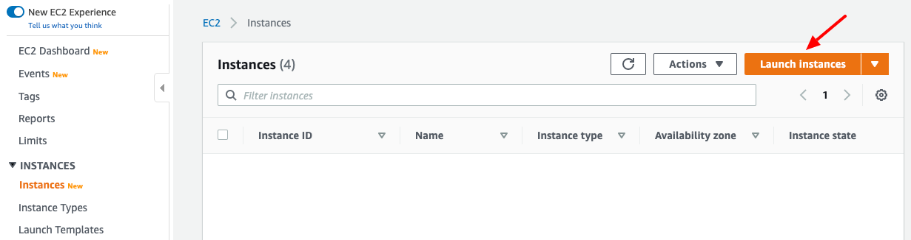
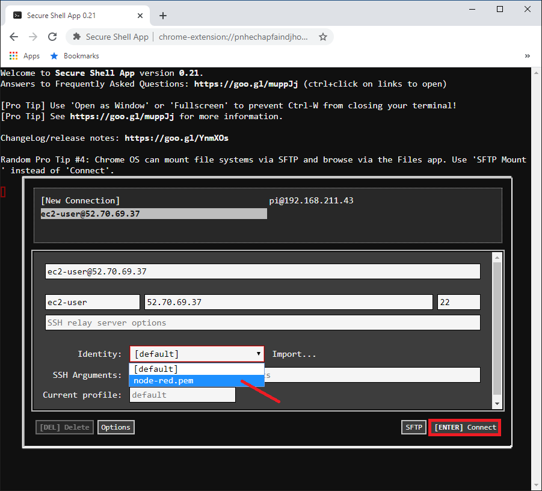
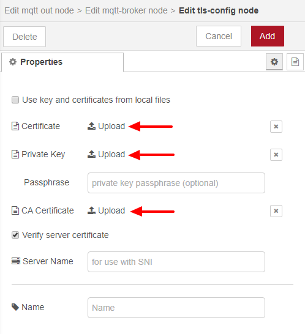
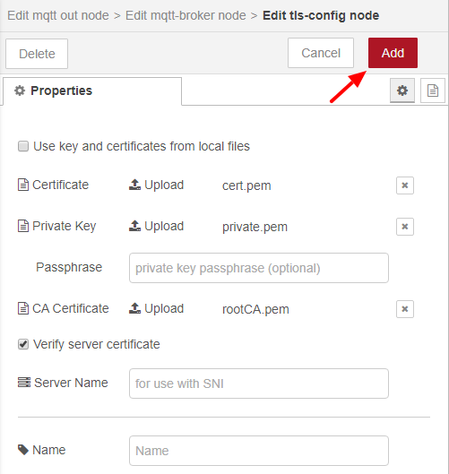
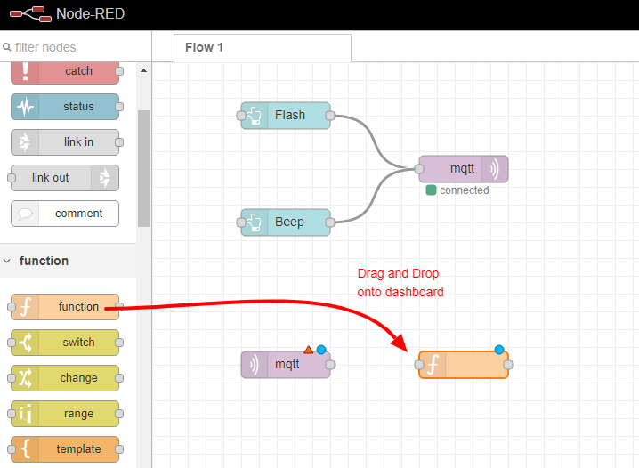

# PART 4: Web-based HMI (Human Machine Interface)

### 1. Launch EC2 Instance running Amazon Linux 2

   - Login to AWS console
   - Go to **Services/EC2** and select **Instances**
   - Press **Launch Instance** button

   

   - Choose the **Amazon Linux 2 - 64-bit** AMI and press the **Select** button

   

   - Choose **General purpose, t2 micro** instance type and press the **Review and Launch** button

   

   - Select **Edit security group**

   

   - Press **Add Rule** button

   

   - Select **Type=HTTP**, **Protocol=TCP**, **Port=80**, **Source=0.0.0.0, ::0**
   - Press **Review and Launch** button

   

   - Select **Create a new key pair**
   - Enter a keypair name of **node-red**
   - Press **Download Key Pair** button

   

   - Press **Launch Instances** button

   

   - Periodically refresh the web page until EC2 instance indicates its status is running (i.e. 2/2 checks passed)
   - Take note of the public IP address. You will use this for your SSH hostname to access below. You will also use this for the URL when accessing your HMI dashboard

   

### 2. SSH onto the EC2 Instance

   - Launch the **Google Chrome Secure Shell App**
   - Enter a username of **ec2-user**, the public IP address of your EC2 instance and enter port **22**
   - Press **Import...** and import the **node-red.pem** file you downloaded when creating your EC2 instance.
   - Select the **node-red.pem** file when prompted.

   
   

   - Select the **node-red.pem** Identity you just imported (NOTE: If it doesn't show up in selection list wait until it does)
   - Press the **[ENTER] Connect** button.

   

### 3. Install Node Red

   pi@raspberrypi:~ $ **wget https://nodejs.org/dist/v10.18.1/node-v10.18.1-linux-x64.tar.gz** 
   pi@raspberrypi:~ $ **sudo su** 
   pi@raspberrypi:~ $ **cd /usr/local** 
   pi@raspberrypi:~ $ **tar xvfz /home/ec2-user/node-v10.18.1-linux-x64.tar.gz** 
   pi@raspberrypi:~ $ **cd /usr/sbin** 
   pi@raspberrypi:~ $ **ln -s /usr/local/node-v10.18.1-linux-x64/bin/node** 
   pi@raspberrypi:~ $ **ln -s /usr/local/node-v10.18.1-linux-x64/bin/npm** 
   pi@raspberrypi:~ $ **exit** 
   pi@raspberrypi:~ $ **mkdir ~/iot-dashboard** 
   pi@raspberrypi:~ $ **cd ~/iot-dashboard** 
   pi@raspberrypi:~ $ **npm init** (press enter whenever prompted to accept default value) 
   pi@raspberrypi:~ $ **npm install -s node-red** 
   pi@raspberrypi:~ $ **npm install -s node-red-dashboard** 
   pi@raspberrypi:~ $ **sudo node node_modules/node-red/red.js --port 80** 

   

### 4. Create HMI Dashboard to send commands to your Raspberry Pi

   - Open another tab in Chrome
   - Enter a URL of **http://YOUR-EC2-INSTANCE-PUBLIC-IP-ADDRESS**
   - Drag and Drop 2 buttons from the pallet on the left onto the dashboard

   

   - Edit your top button by Double-clicking it
   - Press the pencil button to **Add new ui_group...**

   

   - Press the pencil button to **Add new ui_tab...**

   

   - Enter a **Name=IoT Workshop** and
   - Press the **Add** button

   

   - Enter a **Name=Default** and
   - Press the **Add** button

   

   - Select a Group of **[IoT Workshop] Default**
   - Enter a Label of **Flash**
   - Enter a Topic of **mything/flash** and
   - Press the **Done** button

   

   - Select a Group of **[IoT Workshop] Default**
   - Enter a Label of **Beep**
   - Enter a Topic of **mything/beep** and
   - Press the **Done** button

   

   - Drag and Drop **mqtt out** from the pallet on the left onto the dashboard

   

   - Press the pencil button to **Add new mqtt-broker...**

   

   - Enter a Name of **iot-workshop**
   - Enter **Server** with the value of your MQTT Endpoint 
*(NOTE: This value may be obtained from Iot Core/Settings and referring to the Endpoint field)*
   - Enter a Port of **8883**
   - Enter a Cient ID of **node-red**
   - Select **Enable secure (SSL/TLS) certificate**
   - Press the pencil button to **Add new tls-config...**

   

   - Press Certificate **Upload** button and select **cert.pem** 
*NOTE: This is the cert.pem file you downloaded when registering your mything IoT device*
   - Press Private Key **Upload** button and select **private.pem** 
*NOTE: This is the private.pem file you downloaded when registering your mything IoT device*
   - Press CA Certificate **Upload** button and select **rootCA.pem** 
*NOTE: This is the rootCA.pem file you downloaded when registering your mything IoT device*

   
   
   
   

   - Press **Update** button

   

   - Press **Add** button

   

   - Press **Done** button

   

   - Connect Flash Button to MQTT
   - Connect Beep Button to MQTT

   

   - Depoly your IoT Dashboard by pressing the **Depoly** button

   

   - Open a new browser tab to view your dashboard in
   - Enter a URL of **http://YOUR-EC2-INSTANCE-PUBLIC-IP-ADDRESS/ui**
   - Press the **Beep** button and your Raspberry Pi will beep
   - Press the **Flash** button and your red LED on your Raspberry Pi will flash

   

### 5. Modify HMI Dashboard to display IoT telemetry data from Raspberry Pi

   - Drag and Drop **mqtt in** from the pallet on the left onto the dashboard

   

   - Edit **MQTT in** by double-clicking it
   - Select a Server of **iot-workshop**
   - Enter a Topic of **mything/angle**
   - Select a QoS of **1**
   - Press the **Done** button

   

   - Drag and Drop **Function** from the pallet on the left onto the dashboard

   

   - Edit **Function** by double-clicking it
   - Enter a Name of **Extract Value**
   - Enter the following Function code:
   <pre>
   var payload = JSON.parse(msg.payload);
   var newmsg  = { payload: payload.value };

   return newmsg;
   </pre>
   - Press the **Done** button

   

   - Drag and Drop **Chart** from the pallet on the left onto the dashboard

   

   - Edit **Chart** by double-clicking it
   - Select a Group of **[IoT Workshop] Default**
   - Press the **Done** button

   

   - Drag and Drop **Gauge** from the pallet on the left onto the dashboard

   

   - Edit **Gauge** by double-clicking it
   - Select a Group of **[IoT Workshop] Default**
   - Enter a min of **0**
   - Enter a max of **100**
   - Press the **Done** button

   

   - Connect MQTT to Extract Value Function
   - Connect Extract Value Function to Chart
   - Connect Extract Value Function to Gauge

   

   - Depoly your IoT Dashboard by pressing the **Depoly** button

   

   - Go back to your browser tab with the IoT Dashboard in it
   - Turn the angle sensor on your Raspberry Pi and see the chart and gauge on your dashboard change

   

   **BONUS POINTS: Modify your dashboard to have Amazon colors as shown above**
