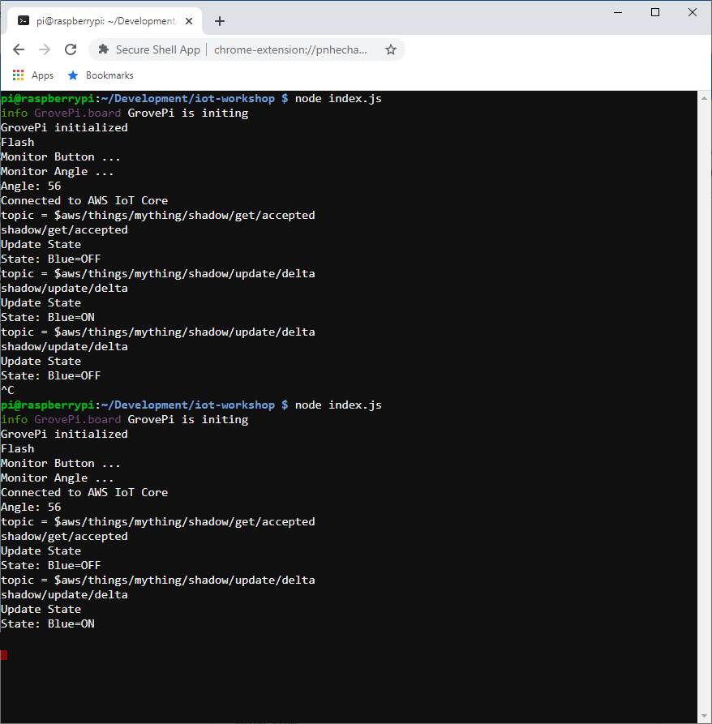

# PART 5: Thing Shadows

In a perfect world your IoT device will be connected to the Internet 24x7x365. However, there are scenarios where this just doesn't hold true. Specifically, there could be ISP outages, Internet outages due to power failures or design-level contraints where your IoT device is battery operated and must be constrained to only connect during select intervals. In order to help ease the control of your IoT devices in these situations, the AWS IoT Core system provides the **Device Shadow Service**. In this lab you will enhance your virtual IoT device program to make use of a **Device Shadow** so that IoT client applications can get and set its state over MQTTS or HTTPS, regardless of whether it is connected to the Internet. Specifically, your application gets and sets the state of the device shadow and your device will synchronize its state with its device shadow when connectivity is re-established.

### Architecture

   

### 1. SSH onto your virtual IoT device

   - Launch the **Google Chrome Secure Shell App** in another tab to start a SSH session
   - Enter a username of **ec2-user**, the IP address of your EC2 instance, enter port **22**, select an Identity of **iot-virtual-device.pem** and press the **[ENTER] Connect** button.

   

### 2. Update your application to use a Thing Shadow

   [ec2-user@ip-172-31-29-44 ~]$ **cd ~/iot-core-device-simulator-master** 
   [ec2-user@ip-172-31-29-44 ~]$ **npm install -s condition-variable** 

   
   [ec2-user@ip-172-31-29-44 ~]$ **nano index.js** 
   Copy and paste the following code into the nano edit session and save the file. 
   **IMPORTANT:** Replace the **host:** value with the Custom Endpoint value you took note of earlier 

<pre>
const AWSIoT   = require('aws-iot-device-sdk');
<b style="color:red">const CondVar  = require('condition-variable');</b>
const express  = require('express');
const http     = require('http');
const minimist = require('minimist');
const WS       = require('ws');

const DEFAULT_PORT = 8080;

const app    = express();
const server = http.createServer(app);
const wss    = new WS.Server({ server });

let device = null;
<b style="color:red">let ver    = 0;
let online = new CondVar();
</b>

function main() {
  let args = minimist(process.argv.slice(2));
  let port = args.port || DEFAULT_PORT;

  app.use('/', express.static('./web'));

  wss.on('connection', onWebSocketConnect);

  server.listen(port, () => {
    console.log('Listening: port=' + server.address().port);
  });

  device = AWSIoT.device({
    keyPath:  './certs/private.pem',
    certPath: './certs/cert.pem',
    caPath:   './certs/rootCA.pem',
    clientId: 'mything',
    region:   'us-east-1',
    protocol: 'mqtts',
    // IMPORTANT: REPLACE THE HOST VALUE BELOW WITH YOUR CUSTOM ENDPOINT VALUE
    host:     'a26erfmc9c0soi-ats.iot.us-east-1.amazonaws.com',
    debug:    'true'
  });

  device.on('connect', onConnect);
  device.on('message', onMessage);</b>
}

function onConnect() {
  console.log('Connected to AWS IoT Core');
  device.subscribe('mything/flash');
  device.subscribe('mything/beep');
  device.subscribe('mything/blue/#');
  <b style="color:red">device.subscribe('$aws/things/mything/shadow/get/accepted');
  device.subscribe('$aws/things/mything/shadow/update/delta');

  online.wait(() => {
    device.publish('mything/messages', '{ "message": "ONLINE" }');
    device.publish('$aws/things/mything/shadow/get', '');
  });</b>
}

function onMessage(topic, buffer) {
  if (topic === 'mything/flash') {
    flash();
  }
  else if (topic === 'mything/beep') {
    beep();
  }
  else if (topic === 'mything/blue/on') {
    blue(1);
  }
  else if (topic === 'mything/blue/off') {
    blue(0);
  }
  <b style="color:red">else if (topic === '$aws/things/mything/shadow/get/accepted') {
    console.log('shadow/get/accepted');
    updateState(buffer);
  }
  else if (topic === '$aws/things/mything/shadow/update/delta') {
    console.log('shadow/update/delta');
    updateState(buffer);
  }</b>
}

function onWebSocketConnect(ws, req) {
  console.log('WebSocket Connected');

  ws.on('message', onWebSocketMessage);
  online.complete();

  flash();
  beep();
}

function onWebSocketMessage(message) {
  let msg = JSON.parse(message);

  if (msg.sensor === 'button') {
    console.log('Button: ' + msg.value);
    device.publish('mything/button', '{ "message": "button", "value": "' + msg.value + '" }');
  }
  else if (msg.sensor === 'angle') {
    console.log('Angle: ' + msg.value);
    angle(msg.value);
    device.publish('mything/angle', '{ "message": "angle", "value": ' + msg.value + ' }');
  }
}

function flash() {
  console.log('Flash');

  red(1);
  setTimeout(() => { red(0); }, 1000);
}

function beep() {
  console.log('Beep');

  buzzer(1);
  setTimeout(() => { buzzer(0); }, 1000);
}

function red(value) {
  send({ command: 'red', value: value });
}

function blue(value) {
  send({ command: 'blue', value: value });
  <b style="color:red">reportState(value ? 'on' : 'off');</b>
}

function angle(value) {
  send({ command: 'angle', value: value });
}

function buzzer(value) {
  send({ command: 'buzzer', value: value });
}

function send(command) {
  wss.clients.forEach((ws) => {
    if (ws.readyState === WS.OPEN) {
      ws.send(JSON.stringify(command));
    }
  });
}
<b style="color:red">
function updateState(buffer) {
  console.log('Update State: ' + buffer);

  try {
    let message = JSON.parse(buffer.toString());

    if (ver < message.version) {
      ver = message.version;

      if (message.state.blue === 'on') {
        console.log('State: Blue=ON');
        blue(1);
        reportState('on');
      }
      else {
        console.log('State: Blue=OFF');
        blue(0);
        reportState('off');
      }
    }
  }
  catch (e) {
    console.log('ERROR: Failed to parse state buffer');
  }
}

function reportState(state) {
  device.publish('$aws/things/mything/shadow/update', '{ "state": { "reported": { "blue": "'+ state +'" } } }');
}
</b>
main();
</pre>

   - Start the application and connect your thing to AWS IoT Core 
   [ec2-user@ip-172-31-29-44 ~]$ **cd ~/iot-core-device-simulator-master** 
   [ec2-user@ip-172-31-29-44 ~]$ **sudo node index.js --port=80**

### 3. Test Connected Device Operations Using The Thing Shadow

**In one tab open the Thing Test page and publish Thing Shadow updates**
   - Login to AWS console
   - Go to **Services/IoT Core**
   - Select **Test**
   - Press **Publish to a topic** 
   - Specify a topic = **$aws/things/mything/shadow/update**
     and a body of the following
<pre>
  {
    "state": {
      "desired": {
        "blue": "on"
      }
    }
  }
</pre>
   - Press the **Publish to topic** button 
**Notice that the virtual IoT device's blue LED turns on**

   

**In another tab open the Thing Shadow for your 'mything' device**
   - Login to AWS console
   - Go to **Services/IoT Core**
   - Select **Manage/Things**
   - Press **mything**
   - Select **Shadow** 
**Notice the "desired" and "reported" states show the blue LED are both "on"**

   

**Go back to the tab pane where you opened the Thing Test page to publish messages**
   - Specify a topic of **$aws/things/mything/shadow/update**
     and a body of the following
<pre>
  {
    "state": {
      "desired": {
        "blue": "off"
      }
    }
  }
</pre>
   - Press the **Publish to topic** button 
**Notice that the virtual IoT device's blue LED turns off**

   

**Go back to the tab pane where you opened the Thing Shadow**

**Notice the "desired" and "reported" states show the blue LED are both "off"**

   

### 4. Test Disconnected Device Operations Using The Thing Shadow

**Go to the tab pane where you opened the SSH session to your virtual IoT device**
   - Stop the running program by pressing Control-C (This will simulate a lost network connection)

   

**Go back to the tab pane where you opened the Thing Test page to publish messages**
   - Specify a topic of **$aws/things/mything/shadow/update**
     and a body of the following
<pre>
  {
    "state": {
      "desired": {
        "blue": "on"
      }
    }
  }
</pre>
   - Press the **Publish to topic** button 
**Notice that the virtual IoT device's blue LED remains off**

**Go back to the tab pane where you opened the Thing Shadow**

**Notice the "desired" state is "on" while the "reported" state indicates its last know state is "off"**

   

**Go to the tab pane where you opened the SSH session to your virtual IoT Device**
   - Start the program running again (This will simulate the network restablishing connectivity)

   
**Notice that the virtual IoT device's blue LED turns on**

**Go back to the tab pane where you opened the Thing Shadow**

**Notice the "desired" and "reported" states show the blue LED are both "on"**

   

# Congratulations, Workshop Complete!!!