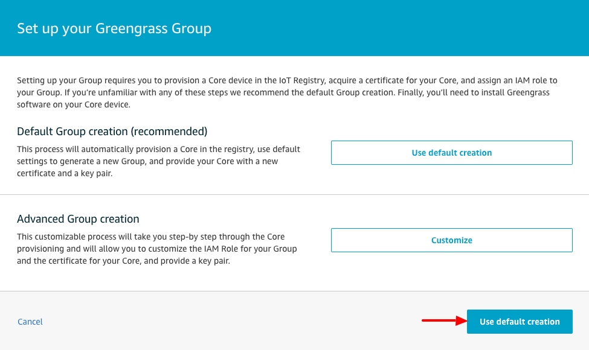
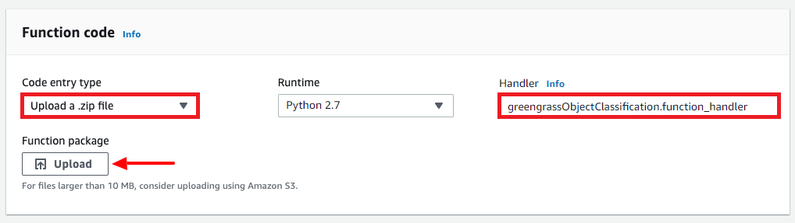
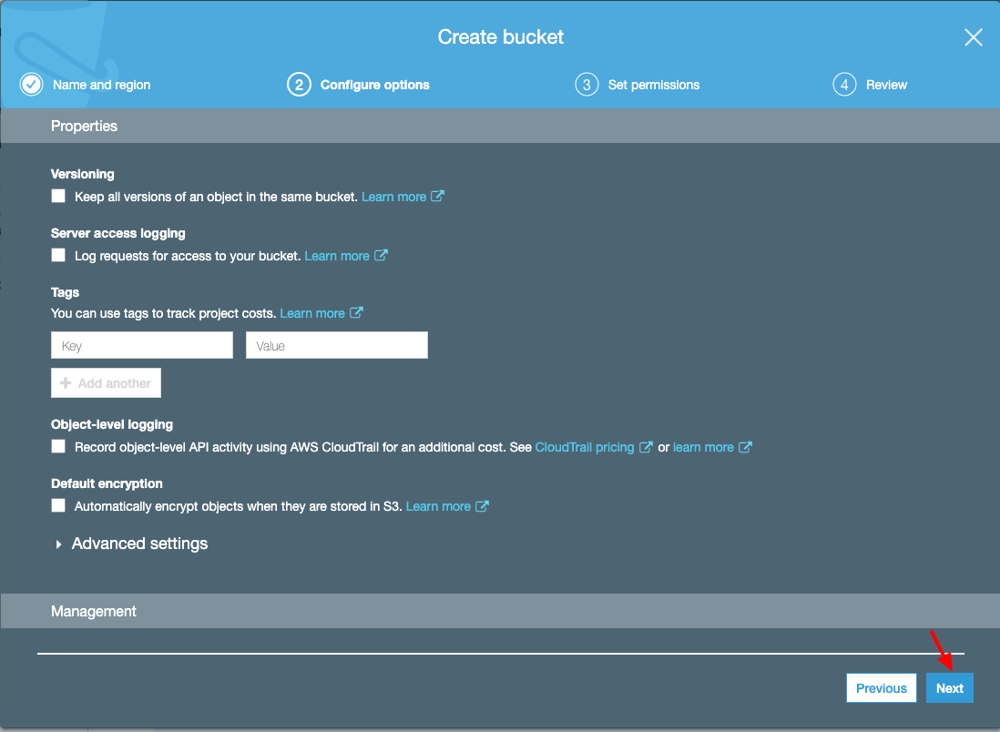
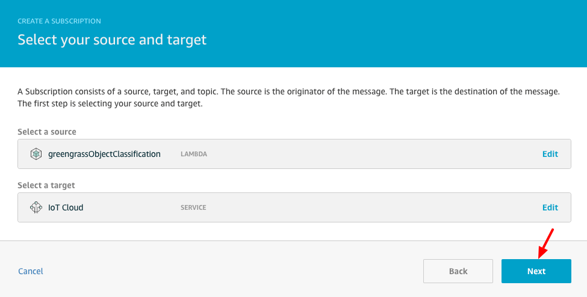

# PART 6: Greengrass Running Machine Learning At The Edge

In a perfect world your IoT device will be connected to the Internet 24x7x365. However, there are scenarios where this just doesn't hold true. Specifically, there could be ISP outages or Internet outages due to power failures. Additionally, there are scenarios where you need to react to events occuring at the edge in a more timely fashion. Specifically, there are scenarios where your application cannot afford the latency involved in communicating events from the edge to the IoT Cloud and back again to provide intelligence. In these scenarios, **AWS IoT Greengrass** seamlessly extends AWS to edge devices so they can act locally on the data they generate, while still using the cloud for management, analytics, and durable storage. With **AWS IoT Greengrass**, devices can run AWS Lambda functions, Docker containers, or both, execute predictions based on machine learning models, keep device data in sync, and communicate with other devices securely – even when not connected to the Internet.

In this lab you will enable your Raspberry Pi to securely connect to the **AWS IoT Greengrass** service and execute Lambda functions locally on images detected from your Pi Camera device. Specifically, you will create an MXNet machine learning, object recognition, Lambda Function which will monitor images it detects on the Pi Camera connected to your Raspberry Pi. The Lambda function will proivide real-time intelligence at the edge and report its findings to your MQTT test client.

### Architecture

   

### 1. SSH onto Raspberry PI using Chrome SSH App
   - Launch the **Google Chrome Secure Shell App** in another tab to start a SSH session
   - Enter a username of **pi**, the IP address displayed on the LCD screen connected to your Raspberry Pi, enter port **80** and press the **[ENTER] Connect** button.

   
   NOTE: The password to use when logging in is written on the brown box of your Raspberry Pi. Also note that the IP address assigned to your Raspberry Pi may differ from the example shown in the screen capture below.

   

### 2. Install MXNet Framework
   - **REFERENCE**: https://docs.aws.amazon.com/greengrass/latest/developerguide/ml-console.html#install-mxnet
   pi@raspberrypi:~ $ **mkdir ~/Development/iot-workshop-greengrass** 
   pi@raspberrypi:~ $ **cd ~/Development/iot-workshop-greengrass** 
   pi@raspberrypi:~ $ **wget https://d1onfpft10uf5o.cloudfront.net/greengrass-ml-installers/mxnet/ggc-mxnet-v1.2.1-python-raspi.tar.gz** 

   

   pi@raspberrypi:~ $ **tar xvfz ggc-mxnet-v1.2.1-python-raspi.tar.gz** 
   pi@raspberrypi:~ $ **cd ggc-mxnet-v1.2.1-python-raspi** 
   pi@raspberrypi:~ $ **./mxnet_installer.sh** 
   pi@raspberrypi:~ $ **sudo wget https://mxnet-public.s3.amazonaws.com/install/raspbian/mxnet-1.5.0-py2.py3-none-any.whl** 
   pi@raspberrypi:~ $ **sudo pip install mxnet-1.5.0-py2.py3-none-any.whl** 
   pi@raspberrypi:~ $ **sudo pip uninstall numpy** 
   pi@raspberrypi:~ $ **sudo pip install numpy** 
   pi@raspberrypi:~ $ **cp greengrassObjectClassification.zip ..** 

   

### 3. Create an MXNet Model Package
   - **REFERENCE**: https://docs.aws.amazon.com/greengrass/latest/developerguide/ml-console.html#package-ml-model
   pi@raspberrypi:~ $ **cd ~/Development/iot-workshop-greengrass** 
   pi@raspberrypi:~ $ **wget https://s3.amazonaws.com/model-server/model_archive_1.0/examples/squeezenet_v1.1/squeezenet_v1.1-0000.params** 
   pi@raspberrypi:~ $ **wget https://s3.amazonaws.com/model-server/model_archive_1.0/examples/squeezenet_v1.1/squeezenet_v1.1-symbol.json** 
   pi@raspberrypi:~ $ **wget https://s3.amazonaws.com/model-server/model_archive_1.0/examples/squeezenet_v1.1/synset.txt** 
   pi@raspberrypi:~ $ **zip squeezenet.zip squeezenet_v1.1-0000.params squeezenet_v1.1-symbol.json synset.txt** 

   

### 4. Secure copy your previously saved MXNet model to your PC

   - Launch the **Google Chrome Secure Shell App** in another tab to start a SFTP session
   - Enter a username of **pi**, the IP address displayed on the LCD screen connected to your Raspberry Pi, enter port **80** and press the **SFTP** button.

   
   NOTE: The password to use when logging in is written on the brown box of your Raspberry Pi. Also note that the IP address assigned to your Raspberry Pi may differ from the example shown in the screen capture below.

   

   pi@raspberrypi:~ $ **cd ~/Development/iot-workshop-greengrass** 
   pi@raspberrypi:~ $ **get greengrassObjectClassification.zip** 
   pi@raspberrypi:~ $ **get squeezenet.zip** 

   
   

### 5. Configure AWS IoT Greengrass
   **REFERENCE**: https://docs.aws.amazon.com/greengrass/latest/developerguide/gg-config.html
   - Login to AWS console
   - Go to **Services/IoT Core** and select **Greengrass**
   - Press **Create a Group** button

   

   - If prompted **Greengrass needs your permission to access other services** then press the **Grant permission** button

   

   - To setup your Greengrass Group we'll use easy creation. A core needs a certificate and keys that allow it to access AWS IoT and an AWS IoT policy that allows it to perform AWS IoT and AWS IoT Greengrass actions. When you choose the **Use easy creation** option, these security resources are created for you and the core is provisioned in the AWS IoT registry.
   - Press **Use easy creation** button

   

   - Enter a Group Name of **MyThingGroup**
   - Press the **Next** button

   

   - Enter a Name of **MyThingGroup_Core**
   - Press the **Next** button

   

   - On the **Run a scripted easy Group creation** page
   - Press the **Create Group and Core** button

   

   - Download your core's security resources and configuration file.
   - Press **Download these resources as a tar.gz** button and save the file locally

   
   
   - Press **Finish** to complete the Greengrass group creation

   
   ---
   

   - Download the **AWS IoT Greengrass Core Software** for your Raspberry Pi (*Ensure you download v1.10.0*)
   - Go to URL https://docs.aws.amazon.com/greengrass/latest/developerguide/what-is-gg.html#gg-core-download-tab
   - Select the **v1.10.0** tab pane.
   - Choose the **Download** link next to **Architecture=Armv7l** with a **Distribution=Raspbian** and an **OS=Linux** and save the file locally

   
   

### 6. Start AWS IoT Greengrass on your Raspberry Pi
   **REFERENCE**: https://docs.aws.amazon.com/greengrass/latest/developerguide/gg-device-start.html
   - In the previous step you downloaded **greengrass-linux-armv7l-1.10.0.tar.gz** and **46942b8cd5-setup.tar.gz** and saved them locally to your computer. (*NOTE: The hash used in the name for your greengrass resources file may diiffer*)
   - We will now secure copy those files onto your Raspberry Pi so we can use them when installing Greengrass.
   - Launch the **Google Chrome Secure Shell App** in another tab to start a SFTP session
   - Enter a username of **pi**, the IP address displayed on the LCD screen connected to your Raspberry Pi, enter port **80** and press the **SFTP** button.

   
   NOTE: The password to use when logging in is written on the brown box of your Raspberry Pi. Also note that the IP address assigned to your Raspberry Pi may differ from the example shown in the screen capture below.

   

   pi@raspberrypi:~ $ **cd ~/Development/iot-workshop-greengrass** 
   pi@raspberrypi:~ $ **put** 

   
   ---
   

   - SSH onto your Raspberry Pi to complete the install of the Greengrass core software.
   - Launch the **Google Chrome Secure Shell App** in another tab to start a SSH session
   - Enter a username of **pi**, the IP address displayed on the LCD screen connected to your Raspberry Pi, enter port **80** and press the **[ENTER] Connect** button.

   
   NOTE: The password to use when logging in is written on the brown box of your Raspberry Pi. Also note that the IP address assigned to your Raspberry Pi may differ from the example shown in the screen capture below.

   

   pi@raspberrypi:~ $ **cd ~/Development/iot-workshop-greengrass** 
   pi@raspberrypi:~ $ **sudo tar xvfz greengrass-linux-armv7l-1.10.0.tar.gz -C /** 

**NOTE: The hash used in the name for your greengrass resources file below will differ. Adjust the command below to match your filename**

   pi@raspberrypi:~ $ **sudo tar xvfz 46942b8cd5-setup.tar.gz -C /greengrass** 

   

   pi@raspberrypi:~ $ **cd /greengrass/certs** 
   pi@raspberrypi:~ $ **sudo wget -O root.ca.pem https://www.amazontrust.com/repository/AmazonRootCA1.pem** 
   - Verify that the download completed successfully by checking that **root.ca.pem** is not empty

   pi@raspberrypi:~ $ **cat /greengrass/certs/root.ca.pem** 

   

   - Start the Greengrass core software

   pi@raspberrypi:~ $ **cd /greengrass/ggc/core** 
   pi@raspberrypi:~ $ **sudo ./greengrassd start** 

   

### 7. Create and Publish Lambda Function For Your Greengrass Group
   **REFERENCE**: https://docs.aws.amazon.com/greengrass/latest/developerguide/ml-console.html#ml-console-create-lambda
   - In this step we'll create a Lambda function so you may associate it with your Greengrass Group. This lambda function will contain your MXNet machine learning inference engine you created previously named **greengrassObjectClassification.zip**.
   - Login to your AWS console
   - Go to **Services/IoT Core**, select **Greengrass** and then **Groups**
   - Select your **MyThingGroup** Greengrass group

   

   - Select **Lambdas**
   - Press the **Add Lambda** button

   

   - On the **Add a Lambda to your Greengrass Group** page
   - Press the **Create new Lambda** button

   **NOTE: This will open a new Chrome Tab to create your Lambda Function from**

   

   - Select **Author from scratch**
   - Enter a **Function name** value of **greengrassObjectClassification**
   - Under **Runtime** select **Python 2.7**
   - For **Permissions**, keep the default setting. This creates an execution role that grants basic Lambda permissions. This role isn't used by AWS IoT Greengrass.
   - Press the **Create function** button

   

   - Scroll down to the **Function code** section
   - Select **Code entry type = Upload a .zip file**
   - Enter a **Handler** value of **greengrassObjectClassification.function_handler**
   - Press the **Upload** button

   

   - Select your **greengrassObjectClassification.zip** file you created and saved previously
   - Press the **Save** button

   

   - Publish the Lambda Function
   - Under the **Actions** pulldown select **Publish new version**

   

   - Enter a version of **v1.0.0**
   - Press the **Publish** button

   

   - Create an alias for the Lambda Function
   - Under the **Actions** pulldown select **Create alias**

   

   - Enter a **Name = mlTest**
   - Enter a **Description = Machine Learning Inference Object Recognition**
   - Select a **Version = 1** from the pulldown list
   - Press the **Create** button

   

### 8. Add Lambda Function to Your Greengrass Group
   **REFERENCE**: https://docs.aws.amazon.com/greengrass/latest/developerguide/ml-console.html#ml-console-config-lambda
   - In this step we'll associate the previously created Lambda Function with your Greengrass Group and configure its lifecycle and environment variables.
   - Login to your AWS console
   - Go to **Services/IoT Core**, select **Greengrass** and then **Groups**
   - Select your **MyThingGroup** Greengrass group

   

   - Select **Lambdas**
   - Press the **Add Lambda** button

   

   - Press the **Use existing Lambda** button

   

   - Select **greengrassObjectClassification**
   - Press the **Next** button

   

   - Select **Alias: mlTest**
   - Press the **Finish** button

   

   - Configure the Lambda function for execution on the Greengrass Groups IoT devices
   - Press the **...** pulldown menu of your **greengrassObjectClassification** Lambda
   - Select **Edit Configuration**

   

   - On the **Group-specific Lambda configuation** page
   - Enter a **Memory limit = 96 MB**
   - Enter a **Timeout = 15 seconds**
   - Under **Lambda lifecycle** select **Make this function long-lived and keep it running indefinitely**
   - Under **Read access to /sys directory** select **Enable**
   - Under **Envionment variables** enter a **Key = MXNET_ENGINE_TYPE** with a **Value = NaiveEngine**
   - Press the **Update** button to save your configuration settings

   

### 9. Add Resources to the Greengrass Group
   **REFERENCE**: https://docs.aws.amazon.com/greengrass/latest/developerguide/ml-console.html#ml-console-add-resources
   - In this step we'll create resources for the camera module and the machine learning inference model. We'll also affiliate the resources with the Lambda function, which makes it possible for the function to access the resources on the IoT device.
   - Login to your AWS console
   - Go to **Services/IoT Core**, select **Greengrass** and then **Groups**
   - Select your **MyThingGroup** Greengrass group

   

   - On the group configuration page
   - Select **Resources**
   - Select the **Local** tab
   - Press the **Add a local resource** button

   

   - On the **Create a local resource** page
   - Enter a **Resource name = videoCoreSharedMemory**
   - Select a **Resource type** of **Device**
   - Enter a **Device path = /dev/vcsm**
   - Select a **Group owner file access permission** of **Automatically add OS group permissions of the Linux group that owns the resource**

   

   - Under the **Lambda function affiliations** section
   - Press **Select**

   

   - Select your **greengrassObjectClassification** Lambda Function
   - Select **Read and write access**
   - Press **Done**

   

   - Press the **Add another resource** button

   

   - On the **Create a local resource** page
   - Enter a **Resource name = videoCoreInterface**
   - Select a **Resource type** of **Device**
   - Enter a **Device path = /dev/vchiq**
   - Select a **Group owner file access permission** of **Automatically add OS group permissions of the Linux group that owns the resource**

   

   - Under the **Lambda function affiliations** section
   - Press **Select**

   

   - Select your **greengrassObjectClassification** Lambda Function
   - Select **Read and write access**
   - Press the **Done** button

   

   - Press the **Save** button

   

   - We'll now add the inference model as a machine learning resource. This step includes uploading the **squeezenet.zip** file we created previously.
   - On the **Resources** page
   - Select the **Machine Learning** tab
   - Press the **Add a machine learning resource** button

   

   - On the **Create a machine learning resource** page
   - Enter a **Resource name = squeezenet_model**
   - Under **Model source** select **Upload a model in S3**
   - Press **Select**

   

   - Press **Upload a model**

**NOTE: This will open another Chrome Tab to S3 where you'll create a Bucket and upload your squeezenet.zip model into**

   

   - Press the **Create bucket** button

   

   **IMPORTANT: Replace the text 'your-name' with your actual name when naming your S3 bucket below**

   - Enter a **Bucket name = greengrass-iot-workshop-your-name-2020-02-20**
   - Press the **Next** button

   

   - Leave all properties with their default values
   - Press the **Next** button

   

   - Leave all permissions with their default value of **Block all public access**
   - Press the **Next** button

   

   - Press the **Create bucket** button

   

   - Select the bucket you just created

   

   - Press the **Upload** button

   

   - Press the **Add files** button

   

   - Select your **squeezenet.zip** file you previously created
   - Press the **Next** button

   

   - Press the **Upload** button

   

   - Once fully uploaded you'll see a screen similar to that shown below indicating its size and properties

   

   - Now that your **squeezenet.zip** file is uploaded to S3 you may close that Chrome Tab
   - Go back the tab with the **Create a machine learning resource** page
   - Scroll down to the **Model from S3** section
   - Press **Refresh** to show your newly created bucket
   - Select your newly created bucket

   

   - Select your **squeezenet.zip** file

   

   - Enter a **Local Path** of **/greengrass-machine-learning/mxnet/squeezenet**
   - Under **Identify resource owner and set access permissions** select **No OS group**

   

   - Under **Lambda function affiliations** press **Select**

   

   - Select your **greengrassObjectClassification** Lambda Function

   

   - Select **Read-only access** and
   - Press **Done**

   

   - Press the **Save** button at the bottom of the page

   

### 10. Add a Subscription to the Greengrass Group
   **REFERENCE**: https://docs.aws.amazon.com/greengrass/latest/developerguide/ml-console.html#ml-console-add-subscription
   - In this step we'll add a subscription to your Greengrass Group. This subscription enables the Lambda Function to send predictive results to AWS IoT Core by publishing to a MQTT topic.
   - Login to your AWS console
   - Go to **Services/IoT Core**, select **Greengrass** and then **Groups**
   - Select your **MyThingGroup** Greengrass group

   

   - On the group configuration page
   - Select **Subscriptions**
   - Press the **Add Subscription** button

   

   - On the **Select your source and target** page
   - Under **Select a source** press **Select**

   

   - Select the **Lambdas** tab
   - Select your **greengrassObjectClassification** Lambda Function

   

   - Under **Select a target** press **Select**

   

   - Select the **Services** tab
   - Select **IoT Cloud**

   

   - Select the **Next** button

   

   - On the **Filter your data with a topic** page
   - Enter a **Topic filter** of **hello/world**
   - Press the **Next** button

   

   - Press the **Finish** button

   

### 11. Deploy the Greengrass Group
   **REFERENCE**: https://docs.aws.amazon.com/greengrass/latest/developerguide/ml-console.html#ml-console-deploy-group
   - In this step we'll deploy the current version of the group definition to the Greengrass IoT device. The definition contains the Lambda function, resources, and subscription configurations that we added previously.
   - Before we begin you should make sure that Greengrass is running on our IoT device. You should have a Chrome tab previously opened with an SSH session to your Raspberry Pi and the Greengrass daemon started within it from steps we completed previously.
   - Login to your AWS console
   - Go to **Services/IoT Core**, select **Greengrass** and then **Groups**
   - Select your **MyThingGroup** Greengrass group

   

   - On the group configuration page
   - Select **Deployments**
   - Under the **Actions** pulldown select **Deploy**

   

   - On the **Configure how devices discover your core** page
   - Press the **Automatic detection** button

   

   - The **Deployments** page will show the **Group history overview** and will indicate the status of your new deployment. You'll notice the **Status** change from **Building deployment** to **In progress** and ultimately to **Successfully completed** as shown below.

   

### 12. Test the Object Detection Machine Learning Inference App
   **REFERENCE**: https://docs.aws.amazon.com/greengrass/latest/developerguide/ml-console.html#ml-console-test-app
   - Login to your AWS console
   - Go to **Services/IoT Core** and then select **Test**
   - Under **Subscriptions** 
   - Enter a **Topic** of **hello/world**
   - Press the **Subscribe to topic** button

   
   ---
   
